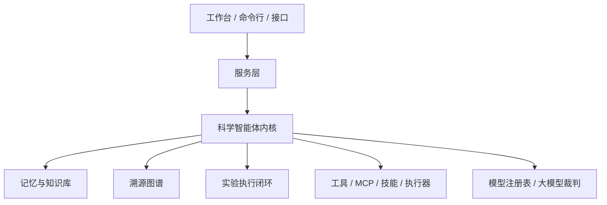
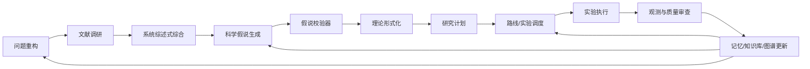
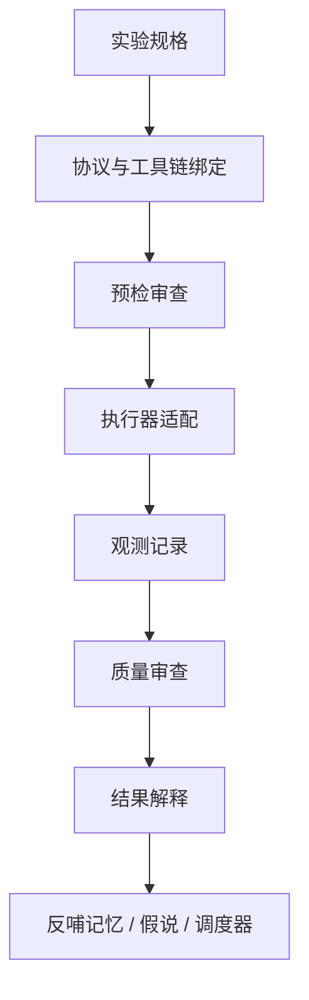

# Kaivu（开物）

Kaivu（开物）是一个用 Python 构建的科学智能体框架。

“开物”取自“格物、开物、致知”的意味：通过观察、推理、实验和构造，打开事物背后的规律。这个项目的目标不是做一个“能回答论文问题的聊天机器人”，而是构建一个可以长期参与科研过程的智能体系统：它能读文献、生成假说、设计实验、记录失败、维护记忆、组织协作，并把每一步都沉淀成可追溯的研究资产。

一句话概括：Kaivu 想做的是面向科研过程的“智能体科研操作系统”。

## 设计理念

科研不是一次性问答，而是一个长期、反复、多人协作、证据驱动的过程。真正有用的科学智能体不能只会调用大模型，它还需要具备一套科研内核。

Kaivu 的设计建立在几个判断上：

- 科研智能体必须能持续积累，而不是每次从零开始检索和总结。
- 记忆必须分层：个人记忆、项目记忆、研究组记忆、会话记忆、智能体角色记忆应该区别对待。
- 科学知识必须区分状态：事实、假说、偏好、警告、失败尝试、开放问题不能混在一起。
- 文献调研不能只是检索增强生成式摘要，还要逐步形成系统综述风格的证据综合。
- 科学假说不能只追求“看起来新”，还要经过创新性、可行性、可检验性、机制合理性、风险和预期价值校验。
- 实验执行不能只是实验记录，还要形成从计划、执行、观测、质量审查、解释到反哺下一轮决策的闭环。
- 多智能体系统不能只是多个提示词，而要有角色、立场连续性、模型策略、共享记忆和协作机制。
- 科学过程必须可追溯：为什么相信某个结论、依据来自哪里、谁审查过、哪些实验失败过，都应该能查到。

所以 Kaivu 的核心不是“对话”，而是“让科研状态随着每次行动变得更清楚”。

## 三层架构

Kaivu 按三层来设计：交互层、服务层、科学智能体内核。



- `kaivu/` 是科学智能体内核，包含工作流、记忆、假说、调度器、实验、溯源图谱、评估框架等核心能力。
- `service/` 是服务层，使用 FastAPI 把核心能力暴露成记忆、文献、工作流、图谱、实验、报告、协作等接口。
- `web/` 是前端工作台层，后续可以做成类似 Codex 的对话式科研驾驶舱，但内核不依赖前端运行。

## 科研主链路

Kaivu 的主链路不是线性的，而是一个不断循环的科研过程。



这个闭环的关键是：负结果和失败尝试也会进入系统。一个失败实验不只是“失败了”，它可能会降低某条假说分支的优先级，触发异常检测，推动问题重构，或者成为未来避免重复踩坑的重要记忆。

## 核心能力

当前框架已经覆盖这些方向：

- 文献工具：PubMed、arXiv、Crossref、DOI、PMID 检索和解析。
- 文献综合：证据质量、冲突归因、系统综述式总结、研究空白识别。
- 假说生成：候选假说、机制族、预测、可证伪条件、优先级。
- 假说校验：创新性、可行性、可检验性、机制合理性、证据支持、风险和预期价值。
- 理论形式化：把松散想法转成假设、变量、机制、预测和反例条件。
- 研究计划器：把单步任务扩展成多阶段研究计划。
- 路线调度器：决定下一步应该调用哪些智能体或工作流路径。
- 实验调度器：根据成本、风险、不确定性、信息增益和资源约束排序实验。
- 实验执行闭环：实验规格、协议、预检、执行、观测、质量审查、解释和反哺。
- 记忆治理：多层级记忆的抽取、迁移、审查、日志化和召回。
- 溯源图谱：连接文献、主张、假说、实验、数据、决策、报告等研究资产。
- 多智能体运行时：多智能体角色、提示词分区、结构化输出、模型策略和子智能体执行。
- 技能、MCP 与工具调用：技能加载、工具注册、权限策略、MCP 标准输入输出接入和执行器适配。
- 评估框架：科学智能体行为的回放、基准测试和回归测试。

## 智能体分层

Kaivu 不是把所有事情都交给一个通用智能体，而是把科研过程拆成多类专业角色。

核心协调层：

- `coordinator`：维护研究状态，决定下一步行动。
- `campaign_planner`：制定多步研究计划。
- `route_scheduler`：选择下一阶段调用哪些智能体或工具。

文献与知识层：

- `literature_reviewer`：检索和初步总结文献。
- `literature_synthesizer`：做系统综述风格的证据综合。
- `evidence_reviewer`：评估证据质量、冲突来源和可信度。
- `knowledge_curator`：维护知识库、记忆和溯源图谱。

假说与理论层：

- `hypothesis_generator`：生成候选科学假说。
- `hypothesis_validator`：校验创新性、可行性、可检验性和机制合理性。
- `problem_reframer`：当问题定义不清时重新表述研究问题。
- `theory_formalizer`：把假说转成机制、变量、预测和可证伪条件。

实验与数据层：

- `experiment_designer`：设计学科适配的实验协议。
- `experiment_scheduler`：排序和选择最值得做的实验。
- `executor_agent`：对接真实执行器、脚本、仿真或未来实验平台。
- `data_curator`：检查数据文件、数据来源和数据质量。
- `data_analyst`：分析结果、发现模式和异常。
- `quality_control_reviewer`：做实验和分析质量审查。

审查与输出层：

- `critic`：寻找反例、漏洞、过度声称和替代解释。
- `safety_ethics_reviewer`：审查安全、伦理和责任边界。
- `report_writer`：生成带引用、证据链和研究状态的报告。

不同智能体可以使用不同模型。比如文献综合、理论批判、调度裁判可以使用更强模型；格式整理、简单报告、局部检索可以使用更便宜的模型。配置入口在 `config/agents.json`。

## 记忆设计

Kaivu 的记忆不是简单聊天历史，而是科学状态管理系统。

当前记忆分为：

- 个人记忆：个人偏好、常用研究风格、长期习惯。
- 项目记忆：当前项目的核心事实、假说、决策和约束。
- 研究组记忆：研究组共享结论、共识、规范和跨方向协作信息。
- 角色记忆：每个智能体角色的立场连续性，例如批判者的长期关注点。
- 会话记忆：当前会话摘要。
- 失败尝试记忆：失败实验、不可行路径、负结果、被否定假说。

每条长期记忆都应该带结构化信息：

- `type`：fact、hypothesis、method、decision、dataset_note、warning、preference、reference、failed_attempt 等。
- `scope`：personal、project、group、agent、session、local。
- `evidence_level`：证据强度。
- `confidence`：置信度。
- `status`：active、tentative、superseded、rejected 等。
- `source_refs`：来源文献、实验、会话或文件。
- `owner_agent`：创建或维护这条记忆的智能体。
- `last_verified_at`：最近验证时间。
- `supersedes` / `superseded_by`：知识更新关系。

这个设计是为了避免科学智能体把“猜测”当事实，把“旧结论”当新共识，把“失败经验”遗忘掉。

## 文献知识库思路

Kaivu 借鉴了“由大模型维护知识库”的思想，但不是简单让大模型直接改长期知识库。

设计上分为三层：

- 原始来源层：原始论文、网页、数据、PDF、图片，作为不可变来源。
- 摘要消化层：大模型先生成可审查摘要，总结关键信息、证据、冲突和可复用知识。
- 知识库与记忆层：在合适策略下把摘要晋升为主题页、索引、记忆或溯源图谱节点。

交互式科研时，可以先生成摘要，等人确认后再落盘。完全自主化科研时，可以根据风险等级自动晋升低风险内容，同时记录迁移日志。这样既能保持知识积累，又不会让智能体过早污染长期知识库。

## 实验执行闭环

实验执行在 Kaivu 里不是一个日志模块，而是科研决策闭环的一部分。



它需要回答的不只是“实验做了吗”，而是：

- 这个实验为什么值得做？
- 它检验哪条假说或哪组机制？
- 成本、风险、资源和信息增益如何？
- 预期正结果和负结果分别意味着什么？
- 数据质量是否足够支持解释？
- 是否需要复现实验、补实验或放弃假说分支？
- 结果如何进入记忆、图谱和下一轮调度器？

这也是为什么 Kaivu 同时需要 `experiment_scheduler`、`quality_control_reviewer`、`executor_agent`、`interpretation` 和 `experiment_backpropagation`。

## 学科适配

当前重点学科包括：

- 化学：反应条件、试剂、产物表征、产率、安全和可重复性。
- 化工：工艺流程、传质传热、放大效应、过程控制、经济性和安全边界。
- 数学：定义、定理、引理、证明义务、反例、形式一致性。
- 人工智能：数据集、基线、指标、消融、随机种子、算力和可复现训练。
- 物理：模型假设、适用范围、测量装置、不确定性、理论-实验一致性。

不同学科的实验流程差异很大，所以 Kaivu 不把所有实验都压成一个通用模板，而是通过学科适配器和学科工具链保留学科原生结构。

## 溯源图谱

Kaivu 正在把溯源图谱作为研究状态的统一事实源。

图谱应该连接：

- 文献来源
- 文献主张
- 证据评价
- 假说
- 机制族
- 预测
- 实验规格
- 实验运行
- 观测记录
- 质量审查
- 数据和文件资产
- 决策记录
- 报告
- 贡献者和责任记录

这样系统就可以回答更深的问题：我们为什么相信这个结论？这个主张来自哪篇文献？哪个实验支持或反驳了它？谁做过审查？有没有失败尝试被忽略？哪个假说分支正在消耗过多资源？

## 多人科研协作

Kaivu 默认科研不是一个人完成的，而是一个研究组共同推进。

因此系统需要支持：

- 个人记忆和研究组记忆的边界。
- 不同学生或子方向团队的方向记录。
- 共享共识、争议点、组会结论和责任分配。
- 科学贡献和责任台账。
- 记忆迁移的自动化和日志化。
- 多智能体在组会式讨论中的立场连续性。

目标不是替代研究组，而是让研究组少丢上下文、少重复失败、少遗忘关键争议，把更多精力放在真正的科学判断上。

## 目录结构

```text
kaivu-agent/
  kaivu/              科学智能体核心包
  service/            服务层
  web/                前端工作台
  config/             智能体和模型配置
  scripts/            运行脚本
  memory/             项目、会话、知识库风格记忆
  literature/         文献知识库和来源材料
  reports/            生成报告
  test_artifacts/     测试输出和临时产物
```

关键模块：

- `kaivu/director.py`：项目级 `ResearchDirector`，负责科研总控、多人协作、报告和状态整合。
- `kaivu/director_services/`：`ResearchDirector` 的服务化拆分目录，承载研究状态、文献状态、实验状态、memory/graph 同步、报告状态，以及连接 `ScientificAgentRuntime` 的 `DirectorRuntimeBridge`。
- `kaivu/runtime/agent_runtime.py`：`ScientificAgentRuntime`，负责单个科学智能体生命周期运行、capability 解析、工具策略和 trajectory 记录。
- `kaivu/agents/base.py`：`ScientificAgent`，负责稳定科研生命周期、stage plan 和 profile-driven 科学推理接口。
- `kaivu/agents/discipline_agents.py`：`ProfiledScientificAgent` 和 discipline normalization，默认由 profile 驱动生成学科 agent，不再维护一组空学科子类。
- `kaivu/agents/profiles.py`：`DisciplineProfile`、quality gate 和学科 prompt/profile 配置。
- `kaivu/tasks/`：`TaskAdapter` 和 `ScientificTask`，负责把 Kaggle 等具体任务接入统一科研生命周期。
- `kaivu/scientific_kernel.py`：科学智能体内核结构。
- `kaivu/memory.py`：长期记忆和会话记忆。

边界说明见 `docs/director_runtime_boundary.md`：`ResearchDirector` 做项目级科研治理，`ScientificAgentRuntime` 做单 agent 运行，`ScientificAgent` 做科学语义 hook，`director_services` 只做纯状态转换。
- `kaivu/memory_governance.py`：记忆迁移、审查、日志和治理。
- `kaivu/hypotheses.py`：假说结构和校验。
- `kaivu/evidence_review.py`：证据综合和质量审查。
- `kaivu/campaign_planner.py`：多步研究计划。
- `kaivu/route_scheduler.py`：工作流路线调度。
- `kaivu/experiment_scheduler.py`：实验优先级调度。
- `kaivu/research_program.py`：研究计划对象、证据查询、假说迁移、实验组合选择和正式组会记录。
- `kaivu/experiments/`：实验模型、注册表、学科适配和质量审查。
- `kaivu/graph/`：溯源图谱模型和注册表。
- `kaivu/evaluation_harness.py`：评估、基准测试和回放。
- `kaivu/model_registry.py`：多智能体模型配置。
- `kaivu/scheduler_judge.py`：大模型裁判式调度判断。
- `service/main.py`：FastAPI 应用入口。

## 运行方式

本地模拟演示，不需要接口密钥：

```bash
python -m kaivu.stub_demo
```

真实大模型工作流：

```bash
set OPENAI_API_KEY=your_key_here
python scripts/run_demo.py "your research topic"
```

启动服务：

```bash
python scripts/run_service.py
```

常用环境变量：

- `KAIVU_MODEL`：默认模型。
- `KAIVU_MODEL_CONFIG`：每个智能体的模型配置文件路径。
- `KAIVU_MCP_CONFIG`：MCP 服务配置路径。
- `KAIVU_REPORT_PATH`：报告输出路径。
- `KAIVU_DYNAMIC_ROUTING`：是否启用动态路由。

每个智能体可以在 `config/agents.json` 里配置不同模型。

示例：

```json
{
  "agents": {
    "literature_reviewer": {
      "model": "gpt-5",
      "reasoning_effort": "high",
      "max_output_tokens": 2200,
      "allow_web_search": true
    },
    "report_writer": {
      "model": "gpt-5-mini",
      "reasoning_effort": "low",
      "max_output_tokens": 1400
    }
  }
}
```

## 当前成熟度

Kaivu 还不是一个完成态产品，而是一个正在形成的科学智能体框架。现在它已经具备科学智能体内核中最重要的骨架：记忆、文献调研、系统综述、假说生成、假说校验、实验闭环、调度器、溯源图谱、多智能体协作、模型策略、评估框架和服务接口。

后续最值得继续推进的方向：

- 让溯源图谱成为更多运行时决策的唯一事实源。
- 把学科适配器更深地绑定到真实工具链和执行器。
- 增强基准数据集和回放覆盖，让系统升级可回归测试。
- 强化前中期主动控制，让智能体不只是事后总结，而是主动治理研究过程。
- 把前端工作台做成对话式科研驾驶舱，支持长周期文献调研、假说演化和多人协作。

Kaivu 的方向是成为一个能长期陪伴科研组工作的科学协作者：它不只是回答问题，而是帮助研究者记住、推理、验证、修正和构建。
